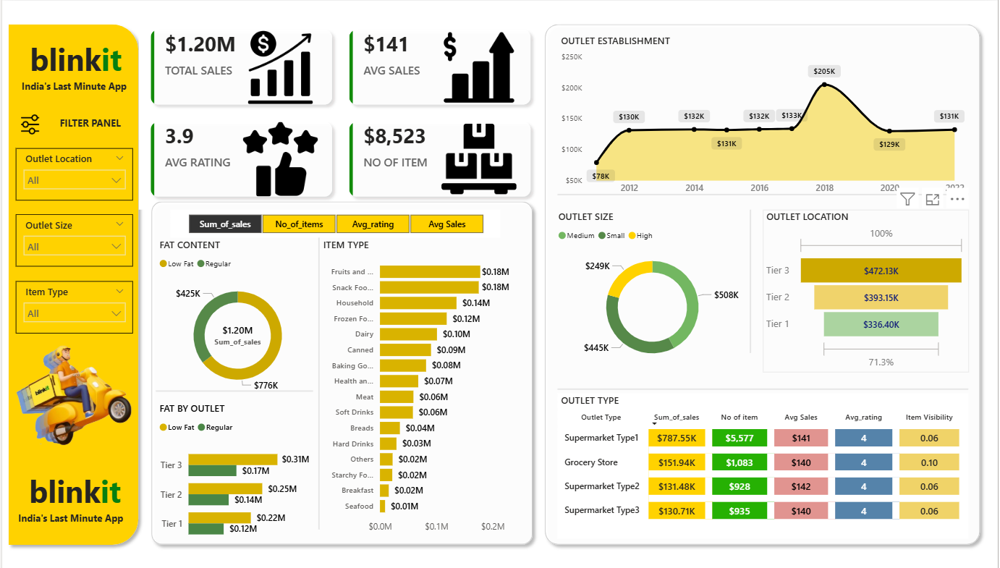

# 🛒 Blinkit Analysis Dashboard

## 📌 Project Overview
This project involves a comprehensive analysis of Blinkit's sales data to derive insights into consumer preferences, outlet performance, and product trends. The dashboard provides a visual summary of $1.20M in total sales across various Indian market segments.

---

## 📊 Key Performance Indicators (KPIs)

| Metric | Value | Description |
| :--- | :--- | :--- |
| **Total Sales** | **$1.20M** | Overall revenue generated across all outlets. |
| **Average Sales** | **$141** | Average revenue per transaction. |
| **No. of Items** | **8,523** | Total count of items sold. |
| **Avg Rating** | **3.9** | Average customer satisfaction rating. |

---

## 🔍 Deep Dive Analysis

### 1. Product & Fat Content Performance
* **Fat Content Preference:** Low Fat products are the primary revenue drivers, generating **$776K** in sales compared to $425K for Regular fat products.
* **Top Categories:** **Fruits & Vegetables** and **Snack Foods** are the leading item types, each contributing **$0.18M** to total revenue.
* **Niche Categories:** Seafood and Breakfast items show the lowest sales volume, indicating specialized or smaller market segments.

### 2. Outlet & Location Insights
* **Outlet Type:** **Supermarket Type 1** is the highest performer, accounting for **$787.55K** in sales and moving 5,577 items.
* **Location Strategy:** **Tier 3** locations generate the highest revenue (**$472.13K**), outperforming Tier 1 and Tier 2 cities.
* **Outlet Size:** **Medium-sized outlets** lead in revenue generation at **$508K**, followed closely by Small outlets at $445K.

### 3. Historical Growth Trends
* **Establishment Peak:** The data shows a significant peak in outlet establishment and sales performance in **2018**, reaching **$205K**.
* **Stability:** Since 2018, sales trends have remained relatively stable, with the most recent data point in 2022 showing **$131K**.

---

## 💡 Strategic Recommendations
1. **Focus on Tier 3 Cities:** Given that Tier 3 locations drive the most revenue, expansion and marketing efforts should be prioritized in these regions.
2. **Promote Low Fat Items:** As Low Fat items contribute nearly double the revenue of Regular fat items, inventory should be weighted heavily toward these preferences.
3. **Optimize Supermarket Type 1:** This outlet type is the most successful; identifying its operational strengths can help improve lower-performing formats like Grocery Stores.

---

## 🛠️ Tech Stack
* **Visualization Tool:** Power BI / Tableau
* **Data Source:** Blinkit Sales Dataset
* **Documentation:** Markdown

---

### How to use this repository
1. Ensure the image file `Blinkit.png` is in the root directory.
2. Clone the repository to view the analysis and dashboard.
